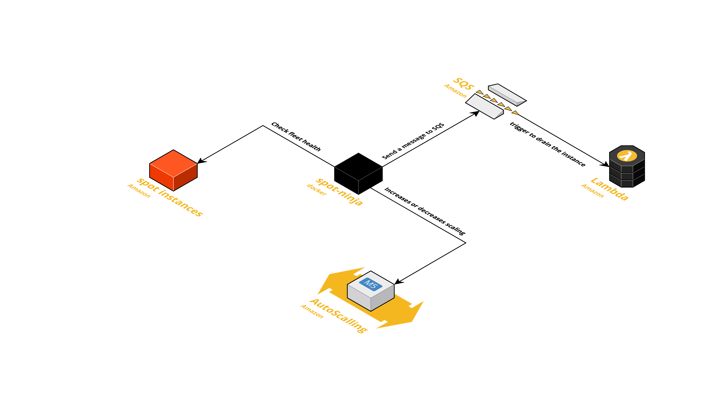
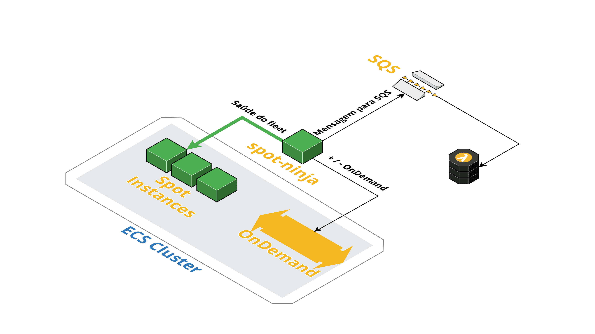

# spot-ninja

[](https://goreportcard.com/report/github.com/getninjas/spot-ninja)
[](https://travis-ci.org/getninjas/spot-ninja)
[](https://godoc.org/github.com/getninjas/spot-ninja)

Available translations:

- [pt-BR](#pt-bR)

This software is responsible for all the intelligence in increasing and decreasing AutoScalingGroups size based on Spotfleet health.

## License

spot ninja is released under the terms of the Apache License. See LICENSE file for more information or see [apache](https://www.apache.org/licenses/LICENSE-2.0).

## Requirements

- Docker >=v1.13.1
- Docker Compose >=1.23.1
- Go >= 1.11.2
- aws-sdk-go Module
- yaml.v2 Module
- Polices:
  - CloudWatchReadOnlyAccess
  - AmazonEC2SpotFleetAutoscaleRole
  - AutoScalingConsoleFullAccess

## Architecture



## ENVs configuration

To configure the spot-ninja, you need to configure some environment variables. The variables are:

- AWS_REGION
  - Default us-east-1
- DATA_POINT_CONFIG
  - Default 30
- STATISTIC_CONFIG
  - Default Average
- FLEET_TYPE_CONFIG
  - Default FleetRequestId
- ID_METRIC_CONFIG
  - Default metric
- SCAN_TYPE_CONFIG
  - Default TimestampDescending
- METRIC_NAME_CONFIG
  - Default PendingCapacity
- NAMESPACE_CONFIG
  - Default AWS/EC2Spot
- UNIT_CONFIG
  - Default Count
- TIME_TO_CONFIG
  - Default 5
- SPEED_CONFIG
  - Default 10
- DIVIDER_CONFIG
  - Default 4
- FLEET_IGNORED
  - Default none
- ENABLE_EVENTS_ON_SQS
  - Default false
- SQS_URL
  - Default none
- PREFIX
  - Default ecs-

## Installing with docker-compose

1 - Build

```bash
docker-compose build
```

2 - Run spot-ninja

```bash
docker-compose up
```

## Project Structure

- cmd/
  - main spot-ninja
- config/
  - general configs to spot ninja
- pkg/
  - general libs

### Refs

- [gopherize](https://www.gopherize.me/)
- [project-layout](https://github.com/golang-standards/project-layout)
- [regex101](https://regex101.com/r/FwSMp7/1/)
- [sdk-for-go](https://docs.aws.amazon.com/sdk-for-go/api/)

## pt-BR

Software responsável pela inteligência de aumentar ou diminuir o tamanho do AutoScalingGroups, baseado na saúde do Spotfleet.

## Licença

spot ninja está licenciada por Apache License. Veja o arquivo LICENSE para mais detalhes ou o link [apache](https://www.apache.org/licenses/LICENSE-2.0).

## Requerimentos

- Docker >=v1.13.1
- Docker Compose >=1.23.1
- Go >= 1.11.2
- Modulo aws-sdk-go
- Modulo yaml.v2
- Polices:
  - CloudWatchReadOnlyAccess
  - AmazonEC2SpotFleetAutoscaleRole
  - AutoScalingConsoleFullAccess

## Arquitetura



## Variáveis de ambiente

Para configurar o spot-ninja, é necessário configurar algumas variáveis de ambiente. As variáveis são:

- AWS_REGION
  - Default us-east-1
- DATA_POINT_CONFIG
  - Padrão 30
- STATISTIC_CONFIG
  - Padrão Average
- FLEET_TYPE_CONFIG
  - Padrão FleetRequestId
- ID_METRIC_CONFIG
  - Padrão metric
- SCAN_TYPE_CONFIG
  - Padrão TimestampDescending
- METRIC_NAME_CONFIG
  - Padrão PendingCapacity
- NAMESPACE_CONFIG
  - Padrão AWS/EC2Spot
- UNIT_CONFIG
  - Padrão Count
- TIME_TO_CONFIG
  - Padrão 5
- SPEED_CONFIG
  - Padrão 10
- DIVIDER_CONFIG
  - Padrão 4
- FLEET_IGNORED
  - Padrão nenhum
- ENABLE_EVENTS_ON_SQS
  - Padrão false
- SQS_URL
  - Padrão nenhum
- PREFIX
  - Padrão ecs-

## Instalando o projeto via o docker-compose

1 - Build via docker-compose

```bash
docker-compose build
```

2 - Execute o spot-ninja

```bash
docker-compose up
```

## Estrutura

- cmd/
  - main spot-ninja
- config/
  - configs gerais do spot ninja
- pkg/
  - libs

## Ref

- [gopherize](https://www.gopherize.me/)
- [project-layout](https://github.com/golang-standards/project-layout)
- [regex101](https://regex101.com/r/FwSMp7/1/)
- [sdk-for-go](https://docs.aws.amazon.com/sdk-for-go/api/)
